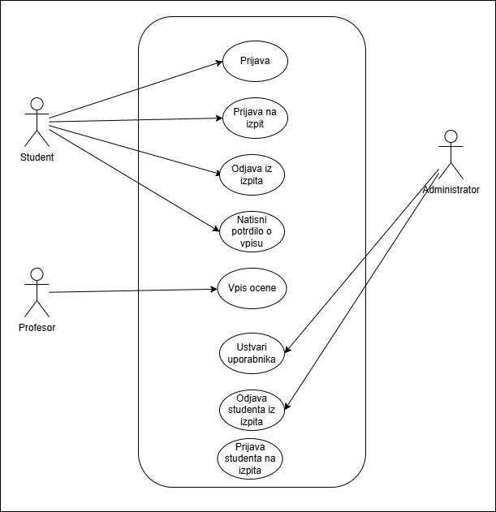

# Use Case Studis

## [Diagram](UseCaseStudis.drawio)

**Student:**
- Prijava v sistem
- Prijava na izpit
- Odjava na izpit
- Potrdilo o vpisu

**Profesor:**
- Vpis ocene

**Administrator:**
- Odjava studenta iz izpita
- Prijava studenta na izpit
##
# Prikaz diagrama

